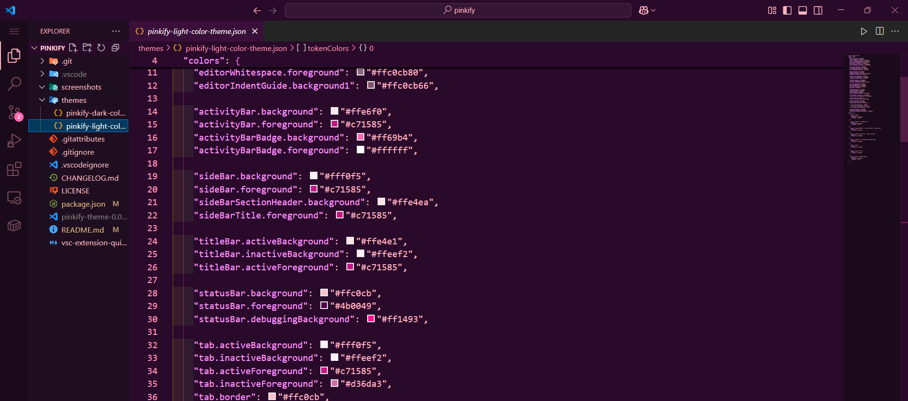
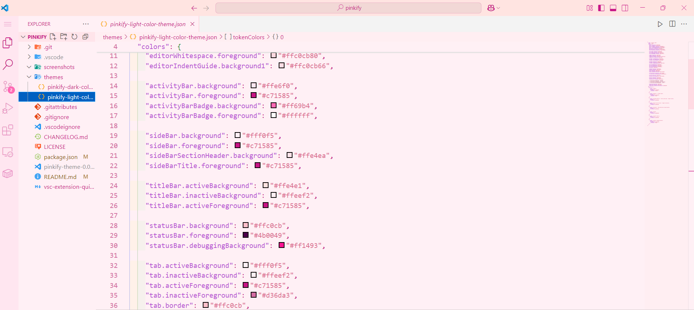

# 🌸 Pinkify Theme for VS Code

Give your Visual Studio Code a stylish **pinkish tint** with the **Pinkify Theme**!  
This theme adds soft contrast, vibrant syntax highlighting, and works with **both light and dark** modes.

## 🔥 Features

- Soft pink UI tint across the editor
- High-contrast syntax for:
  - Keywords
  - Comments
  - Functions
  - Types (`int`, `bool`, etc.)
- Supports both **light** and **dark** variants
- Optimized for readability and aesthetics

## 📸 Preview

### Dark Theme

### Light Theme

## 📝 License

This theme is licensed under the MIT License – see the [LICENSE](./LICENSE) file for details.
